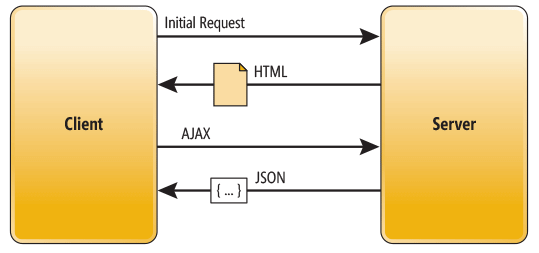
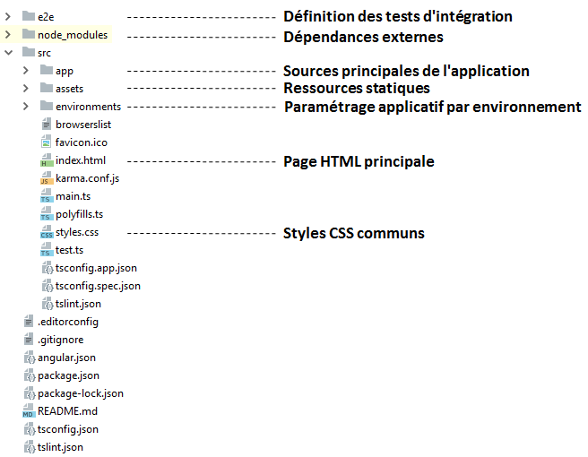
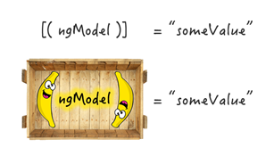

# Formation Angular

---
<!-- .slide: data-background-color="#ffffff" -->

## Introduction

----
<!-- .slide: data-background-color="#ffffff" -->

## Angular ?

- Framework JavaScript Single Page Application
- Créé par Google en 2010
- AngularJS = AngularJS v1 ≠ Angular
- Angular = Angular v2 et supérieures
- Actuellement Angular 11 (depuis le 11/11/2020)
- voir <a href="https://angular.io/guide/releases" target="_blank">roadmap</a>

	

		
	

	

		
	

----
<!-- .slide: data-background-color="#ffffff" -->

## SPA

- **Single Page Application**
  - Dans le navigateur web
  - Une seule page HTML
  - Javascript
  - Pas de rechargement de page pour naviguer entre chaque écran

- **Multi Pages Application**
  - Une page HTML par écran
  - Rechargement des  pages lors de la navigation
  - Les pages sont rendues par le serveur Web
  
----
<!-- .slide: data-background-color="#ffffff" -->

## SPA vs MPA

	

	    <h3>Cycle de vie **MPA**</h3>
        
    

    

        <h3>Cycle de vie **SPA**</h3>
        
    

----
<!-- .slide: data-background-color="#ffffff" -->

## Frameworks SPA

----
<!-- .slide: data-background-color="#DD0031" -->

## Angular vs AngularJS

- Orienté **composants**
  - Plus de scope
  - Plus de controller
- **TypeScript**
- Simplification des directives
- Amélioration de l'injection de dépendances
- Amélioration de la gestion des formulaires et de la validation

----

---

## Langages

----
<!-- .slide: data-background-color="#007ACC" -->

## Typescript

- Extension de ES6
  - **TypeScript = ES6 + Types + Annotations + ...**
- Pas de support natif dans les navigateurs
- Langage transpilé

----
<!-- .slide: data-background-color="#FDE74C" -->

## ES6

- ECMAScript = standardisation de JavaScript
- ES6 = ECMAScript Edition 6 = ECMAScript 2015
- Pas de support natif dans les navigateurs
  - <a href="http://kangax.github.io/compat-table/es6/" target="_blank">Tableau de compatibilité</a>
  - Possibilité d'utiliser un trancompilateur comme <a href="https://babeljs.io/" target="_blank">Babel</a> pour le transformer en ES5
- Fonctionnalités : http://git.io/es6features
  - let, const
  - Arrow Functions
  - Modules
  - Classes
  - Promises

----
<!-- .slide: data-background-color="#FDE74C" -->

## ES6
### var vs let

<iframe src="https://codesandbox.io/embed/github/odangreaux/formation-angular/tree/main/exemples/es6-var-vs-let?fontsize=14&hidenavigation=1&theme=dark"
     style="width:100%; height:500px; border:0; border-radius: 4px; overflow:hidden;"
     title="odangreaux/formation-angular: es6-var-vs-let"
     allow="accelerometer; ambient-light-sensor; camera; encrypted-media; geolocation; gyroscope; hid; microphone; midi; payment; usb; vr; xr-spatial-tracking"
     sandbox="allow-forms allow-modals allow-popups allow-presentation allow-same-origin allow-scripts"
     class="liveCode"
   ></iframe>

https://codesandbox.io/s/github/odangreaux/formation-angular/tree/main/exemples/es6-var-vs-let

----
<!-- .slide: data-background-color="#FDE74C" -->

## ES6
### const

<iframe src="https://codesandbox.io/embed/github/odangreaux/formation-angular/tree/main/exemples/es6-const?fontsize=14&hidenavigation=1&theme=dark"
     style="width:100%; height:500px; border:0; border-radius: 4px; overflow:hidden;"
     title="odangreaux/formation-angular: es6-const"
     allow="accelerometer; ambient-light-sensor; camera; encrypted-media; geolocation; gyroscope; hid; microphone; midi; payment; usb; vr; xr-spatial-tracking"
     sandbox="allow-forms allow-modals allow-popups allow-presentation allow-same-origin allow-scripts"
     class="liveCode"
   ></iframe>

https://codesandbox.io/s/github/odangreaux/formation-angular/tree/main/exemples/es6-const

----
<!-- .slide: data-background-color="#FDE74C" -->

## ES6
### Arrow functions

<iframe src="https://codesandbox.io/embed/github/odangreaux/formation-angular/tree/main/exemples/es6-arrow-functions?fontsize=14&hidenavigation=1&theme=dark"
     style="width:100%; height:500px; border:0; border-radius: 4px; overflow:hidden;"
     title="odangreaux/formation-angular: es6-arrow-functions"
     allow="accelerometer; ambient-light-sensor; camera; encrypted-media; geolocation; gyroscope; hid; microphone; midi; payment; usb; vr; xr-spatial-tracking"
     sandbox="allow-forms allow-modals allow-popups allow-presentation allow-same-origin allow-scripts"
     class="liveCode"
   ></iframe>

https://codesandbox.io/s/github/odangreaux/formation-angular/tree/main/exemples/es6-arrow-functions

----
<!-- .slide: data-background-color="#FDE74C" -->

## ES6
### Modules

<iframe src="https://codesandbox.io/embed/github/odangreaux/formation-angular/tree/main/exemples/es6-modules?fontsize=14&hidenavigation=1&theme=dark"
     style="width:100%; height:500px; border:0; border-radius: 4px; overflow:hidden;"
     title="odangreaux/formation-angular: es6-modules"
     allow="accelerometer; ambient-light-sensor; camera; encrypted-media; geolocation; gyroscope; hid; microphone; midi; payment; usb; vr; xr-spatial-tracking"
     sandbox="allow-forms allow-modals allow-popups allow-presentation allow-same-origin allow-scripts"
     class="liveCode"
   ></iframe>

https://codesandbox.io/s/github/odangreaux/formation-angular/tree/main/exemples/es6-modules

----
<!-- .slide: data-background-color="#FDE74C" -->

## ES6
### Classes

<iframe src="https://codesandbox.io/embed/github/odangreaux/formation-angular/tree/main/exemples/es6-classes?fontsize=14&hidenavigation=1&theme=dark"
     style="width:100%; height:500px; border:0; border-radius: 4px; overflow:hidden;"
     title="odangreaux/formation-angular: es6-classes"
     allow="accelerometer; ambient-light-sensor; camera; encrypted-media; geolocation; gyroscope; hid; microphone; midi; payment; usb; vr; xr-spatial-tracking"
     sandbox="allow-forms allow-modals allow-popups allow-presentation allow-same-origin allow-scripts"
     class="liveCode"
   ></iframe>

https://codesandbox.io/s/github/odangreaux/formation-angular/tree/main/exemples/es6-classes

----
<!-- .slide: data-background-color="#FDE74C" -->

## ES6
### Classes avec modules

<iframe src="https://codesandbox.io/embed/github/odangreaux/formation-angular/tree/main/exemples/es6-classes-modules?fontsize=14&hidenavigation=1&theme=dark"
     style="width:100%; height:500px; border:0; border-radius: 4px; overflow:hidden;"
     title="odangreaux/formation-angular: es6-classes-modules"
     allow="accelerometer; ambient-light-sensor; camera; encrypted-media; geolocation; gyroscope; hid; microphone; midi; payment; usb; vr; xr-spatial-tracking"
     sandbox="allow-forms allow-modals allow-popups allow-presentation allow-same-origin allow-scripts"
     class="liveCode"
   ></iframe>

https://codesandbox.io/s/github/odangreaux/formation-angular/tree/main/exemples/es6-classes-modules

----
<!-- .slide: data-background-color="#FDE74C" -->

## ES6
### Avant les promises

<iframe src="https://codesandbox.io/embed/github/odangreaux/formation-angular/tree/main/exemples/es6-sans-promise?fontsize=14&hidenavigation=1&theme=dark"
     style="width:100%; height:500px; border:0; border-radius: 4px; overflow:hidden;"
     title="odangreaux/formation-angular: es6-sans-promise"
     allow="accelerometer; ambient-light-sensor; camera; encrypted-media; geolocation; gyroscope; hid; microphone; midi; payment; usb; vr; xr-spatial-tracking"
     sandbox="allow-forms allow-modals allow-popups allow-presentation allow-same-origin allow-scripts"
     class="liveCode"
   ></iframe>

https://codesandbox.io/s/github/odangreaux/formation-angular/tree/main/exemples/es6-sans-promise

----
<!-- .slide: data-background-color="#FDE74C" -->

## ES6
### Avec les promises

<iframe src="https://codesandbox.io/embed/github/odangreaux/formation-angular/tree/main/exemples/es6-avec-promise?fontsize=14&hidenavigation=1&theme=dark"
     style="width:100%; height:500px; border:0; border-radius: 4px; overflow:hidden;"
     title="odangreaux/formation-angular: es6-avec-promise"
     allow="accelerometer; ambient-light-sensor; camera; encrypted-media; geolocation; gyroscope; hid; microphone; midi; payment; usb; vr; xr-spatial-tracking"
     sandbox="allow-forms allow-modals allow-popups allow-presentation allow-same-origin allow-scripts"
     class="liveCode"
   ></iframe>

https://codesandbox.io/s/github/odangreaux/formation-angular/tree/main/exemples/es6-avec-promise

----
<!-- .slide: data-background-color="#007ACC" -->

## Typescript

- **TypeScript = ES6 + Types + Annotations + ...**
- Les fonctionanilités supplémentaires de TypeScript sont utilisées par le compilateur et l'IDE et sont surtout une aide au développement
    - signalement des problèmes de typage lors du codage
    - complétion

----
<!-- .slide: data-background-color="#007ACC" -->

## Typescript
### Typage

<iframe src="https://codesandbox.io/embed/github/odangreaux/formation-angular/tree/main/exemples/ts-typage?fontsize=14&hidenavigation=1&theme=dark"
     style="width:100%; height:500px; border:0; border-radius: 4px; overflow:hidden;"
     title="odangreaux/formation-angular: ts-typage"
     allow="accelerometer; ambient-light-sensor; camera; encrypted-media; geolocation; gyroscope; hid; microphone; midi; payment; usb; vr; xr-spatial-tracking"
     sandbox="allow-forms allow-modals allow-popups allow-presentation allow-same-origin allow-scripts"
     class="liveCode"
   ></iframe>

https://codesandbox.io/s/github/odangreaux/formation-angular/tree/main/exemples/ts-typage

----
<!-- .slide: data-background-color="#007ACC" -->

## Typescript
### Classes : modifieurs

<iframe src="https://codesandbox.io/embed/github/odangreaux/formation-angular/tree/main/exemples/ts-modifieurs?fontsize=14&hidenavigation=1&theme=dark"
     style="width:100%; height:500px; border:0; border-radius: 4px; overflow:hidden;"
     title="odangreaux/formation-angular: ts-modifieurs"
     allow="accelerometer; ambient-light-sensor; camera; encrypted-media; geolocation; gyroscope; hid; microphone; midi; payment; usb; vr; xr-spatial-tracking"
     sandbox="allow-forms allow-modals allow-popups allow-presentation allow-same-origin allow-scripts"
     class="liveCode"
   ></iframe>

https://codesandbox.io/s/github/odangreaux/formation-angular/tree/main/exemples/ts-modifieurs

----
<!-- .slide: data-background-color="#007ACC" -->

## Typescript
### Interfaces
<iframe src="https://codesandbox.io/embed/github/odangreaux/formation-angular/tree/main/exemples/ts-interface?fontsize=14&hidenavigation=1&theme=dark"
     style="width:100%; height:500px; border:0; border-radius: 4px; overflow:hidden;"
     title="odangreaux/formation-angular: ts-interface"
     allow="accelerometer; ambient-light-sensor; camera; encrypted-media; geolocation; gyroscope; hid; microphone; midi; payment; usb; vr; xr-spatial-tracking"
     sandbox="allow-forms allow-modals allow-popups allow-presentation allow-same-origin allow-scripts"
     class="liveCode"
   ></iframe>

https://codesandbox.io/s/github/odangreaux/formation-angular/tree/main/exemples/ts-interface

----
<!-- .slide: data-background-color="#007ACC" -->

## Typescript
### Enum

<iframe src="https://codesandbox.io/embed/github/odangreaux/formation-angular/tree/main/exemples/ts-enum?fontsize=14&hidenavigation=1&theme=dark"
     style="width:100%; height:500px; border:0; border-radius: 4px; overflow:hidden;"
     title="odangreaux/formation-angular: ts-enum"
     allow="accelerometer; ambient-light-sensor; camera; encrypted-media; geolocation; gyroscope; hid; microphone; midi; payment; usb; vr; xr-spatial-tracking"
     sandbox="allow-forms allow-modals allow-popups allow-presentation allow-same-origin allow-scripts"
     class="liveCode"
   ></iframe>

https://codesandbox.io/s/github/odangreaux/formation-angular/tree/main/exemples/ts-enum

----
<!-- .slide: data-background-color="#007ACC" -->

## Typescript
### Génériques

<iframe src="https://codesandbox.io/embed/github/odangreaux/formation-angular/tree/main/exemples/ts-generics?fontsize=14&hidenavigation=1&theme=dark"
     style="width:100%; height:500px; border:0; border-radius: 4px; overflow:hidden;"
     title="odangreaux/formation-angular: ts-generics"
     allow="accelerometer; ambient-light-sensor; camera; encrypted-media; geolocation; gyroscope; hid; microphone; midi; payment; usb; vr; xr-spatial-tracking"
     sandbox="allow-forms allow-modals allow-popups allow-presentation allow-same-origin allow-scripts"
     class="liveCode"
   ></iframe>

https://codesandbox.io/s/github/odangreaux/formation-angular/tree/main/exemples/ts-generics

----
<!-- .slide: data-background-color="#007ACC" -->

## Typescript
### Autres fonctionnalités

- Décorateurs (annotations)
- <a href="https://www.typescriptlang.org/docs/handbook/basic-types.html" target="_blank">Handbook Typescript</a>

----

----

## TP

<iframe src="https://giphy.com/embed/ukMiDlCmdv2og" width="480" height="360" frameBorder="0" class="giphy-embed" allowFullScreen></iframe>
<a href="http://gitlab.svc.sigma.host/ed_dt/formation_angular/formation-angular-tp01" target="_blank">http://gitlab.svc.sigma.host/ed_dt/formation_angular/formation-angular-tp01</a>

Note:
Création d'un module dans Stackblitz :
- utilisation de l'API de codes postaux
- création d'une interface
- chargement d'un flux JSON
- chargement et utilisation du module

---

## Les outils

----
<!-- .slide: data-background-color="#84C665" -->

## Node / npm

- Node
  - Moteur JS
- npm
  - Node Package Manager
  - Similaire à Maven
  - Gestion des dépendances
  - Outils de build
- Alternative recommandée à npm : yarn

----
<!-- .slide: data-background-color="#84C665" -->

## Node / npm

- Installation : <a href="https://nodejs.org" target="_blank">https://nodejs.org</a>
- Attention à la configuration du proxy

<pre><code data-trim data-noescape class="bash">
npm config set proxy http://proxy-pc.na01.groupesigma.fr:8080
npm config set https-proxy http://proxy-pc.na01.groupesigma.fr:8080
</code></pre>
- Installation de module : <pre><code data-trim data-noescape class="bash">npm install</code></pre>
- La gestion des dépendances d'un projet est définie dans son fichier `package.json`

----
<!-- .slide: data-background-color="#84C665" -->

## Node / npm
Exemple de fichier `package.json` :
<pre><code data-trim data-noescape class="json">
{
  "name": "test3",
  "version": "0.0.0",
  "scripts": {
    "ng": "ng",
    "start": "ng serve",
    "build": "ng build",
    "test": "ng test",
    "lint": "ng lint",
    "e2e": "ng e2e"
  },
  "private": true,
  "dependencies": {
    "@angular/animations": "^6.0.3",
    "@angular/common": "^6.0.3",
    "@angular/compiler": "^6.0.3",
    "@angular/core": "^6.0.3",
    "@angular/forms": "^6.0.3",
    "@angular/http": "^6.0.3",
    "@angular/platform-browser": "^6.0.3",
    "@angular/platform-browser-dynamic": "^6.0.3",
    "@angular/router": "^6.0.3",
    "core-js": "^2.5.4",
    "rxjs": "^6.0.0",
    "zone.js": "^0.8.26"
  },
  "devDependencies": {
    "@angular/compiler-cli": "^6.0.3",
    "@angular-devkit/build-angular": "~0.6.8",
    "typescript": "~2.7.2",
    "@angular/cli": "~6.0.8",
    "@angular/language-service": "^6.0.3",
    "@types/jasmine": "~2.8.6",
    "@types/jasminewd2": "~2.0.3",
    "@types/node": "~8.9.4",
    "codelyzer": "~4.2.1",
    "jasmine-core": "~2.99.1",
    "jasmine-spec-reporter": "~4.2.1",
    "karma": "~1.7.1",
    "karma-chrome-launcher": "~2.2.0",
    "karma-coverage-istanbul-reporter": "~2.0.0",
    "karma-jasmine": "~1.1.1",
    "karma-jasmine-html-reporter": "^0.2.2",
    "protractor": "~5.3.0",
    "ts-node": "~5.0.1",
    "tslint": "~5.9.1"
  }
}
</code></pre>

----
<!-- .slide: data-background-color="#2C8EBB" -->

## Yarn

- Alternative à npm
- Compatible avec npm et utilise les fichiers `package.json`
- Plus simple et plus rapide
- Attention à la configuration du proxy

<pre><code data-trim data-noescape class="bash">
yarn config set proxy http://proxy-pc.na01.groupesigma.fr:8080
yarn config set https-proxy http://proxy-pc.na01.groupesigma.fr:8080
</code></pre>

- Installation : <a href="https://yarnpkg.com" target="_blank">https://yarnpkg.com</a>

----
<!-- .slide: data-background-color="#F44336" -->

## Angular CLI

- Fonctions :
  - Création des différents éléments Angular
  - Démarrage du serveur de développement
- Installation :

<pre><code data-trim data-noescape class="bash">
npm install -g @angular/cli
</code></pre>

----
<!-- .slide: data-background-color="#ffff" -->

## IDE

	

	    Visual Studio Code
        
        _Gratuit_
    

    

        Webstorm
        
        _Payant_
    

    

        IntelliJ IDEA Ultimate
        
        _Payant_
    

    

        Stackblitz
        
        _Gratuit, en ligne_
    

----

<!-- .slide: data-background-color="#ffff" -->

## Débogage dans le navigateur

- La console navigateur
- Via l'IDE
- Extension Chrome : <a href="https://augury.angular.io/" target="_blank">Angury</a>

----

---

## Les concepts

----

<!-- .slide: data-background-color="#ffff" -->

## Architecture d'une application Angular

----

<!-- .slide: data-background-color="#ffff" -->

## Application

Création d'une nouvelle application :

<pre><code data-trim data-noescape class="bash">
ng new mon-application
</code></pre>

----

<!-- .slide: data-background-color="#ffff" -->

## Structure d'une application Angular

----

<!-- .slide: data-background-color="#FFE66D" -->

## Module

- Organiser l'application en ensembles cohérents de fonctionnalités (métier, techniques, utilitaires, …)
- Etendre les capacités de l'application avec des modules externes

<pre><code data-trim data-noescape class="typescript">
import { NgModule } from '@angular/core';
import { BrowserModule } from '@angular/platform-browser';
import { FormsModule } from '@angular/forms';

import { AppComponent } from './app.component';
import { HelloComponent } from './hello.component';
import { UnComposantComponent } from './un-composant/un-composant.component';
import { UnServiceService } from './un-service.service';

@NgModule({
  imports: [BrowserModule, FormsModule],                              // import d'autres modules
  declarations: [AppComponent, HelloComponent, UnComposantComponent], // les services exposés par ce module
  exports: [UnComposantComponent],                                    // les déclarations qui sont exposées aux modules externes
  providers: [UnServiceService],                                      // les services exposés par ce module
  bootstrap: [AppComponent]                                           // le composant principal de l'application
                                                                      // (uniquement pour le module racine)
})
export class AppModule { }
</code></pre>

- Une application Angular contient au minimum un module : le module racine

----

<!-- .slide: data-background-color="#FFE66D" -->

## Module

- Fonctionnalités avancées :
  - Lazy loading de modules
  - Re-export de module
  
Création d'un module :

<pre><code data-trim data-noescape class="bash">
ng generate module mon-module
</code></pre>

----

<!-- .slide: data-background-color="#FFE66D" -->

## Module

- Bonne pratiques :
  - Un module par grande fonctionnalité métier
  - Un module pour les éléments utilitaires réutilisables
  - Un module pour les éléments transverses (authentification, habilitation, …)
  - Pas de dépendances circulaires de modules

----

<!-- .slide: data-background-color="#4ECDC4" -->

## Composant

- Encapsulation réutilisable ou non des éléments d'un sous ensemble d'un écran
  - Données affichées et saisies
  - Code HTML
  - Styles CSS
  - Interactions utilisateur
  - Comportements et appels des traitements

----

<!-- .slide: data-background-color="#4ECDC4" -->

## Composant
### Classe et métadonnées

<pre><code data-trim data-noescape class="typescript">
import { Component, OnInit } from '@angular/core';

@Component({
  selector: 'app-composant1',
  templateUrl: './composant1.component.html',
  styleUrls: ['./composant1.component.css']
})
export class Composant1Component implements OnInit {
  uneDonnee: String;
  
  constructor() { }
  
  ngOnInit() {
    this.uneDonnee = 'ma donnée';
  }
  
  logUneDonnee() {
    console.log(this.uneDonnee);
  }
}
</code></pre>

----
<!-- .slide: data-background-color="#4ECDC4" -->

## Composant
### Template

- Code HTML

<pre><code data-trim data-noescape class="html">
&lt;p&gt;
    Une donn&eacute;e : &lt;input [(ngModel)]='uneDonnee' /&gt;&nbsp;{{uneDonnee}}
&lt;/p&gt;
&lt;button (click)='logUneDonnee()'&gt;logUneDonnee&lt;/button&gt;
</code></pre>

- Structure de la portion d'écran affichée
- Affichage et saisie des données
- Définitions des interactions utilisateur
- Utilise les éléments définis ou importés par l'application : autres composants, directives, pipes

----
<!-- .slide: data-background-color="#4ECDC4" -->

## Composant
### Styles CSS

<pre><code data-trim data-noescape class="css">
div {
  background-color: lightskyblue;
}
</code></pre>

- Les styles CSS définis au niveau du composant sont spécifiques au composant
- Sélecteurs spécifiques :
  - Style de l'élément hôte :
<pre><code data-trim data-noescape class="css">
:host { display: block; border: 1px solid black; }
:host(.active) {border-width: 3px;}
</code></pre>
  - Référence aux styles des éléments parents :
<pre><code data-trim data-noescape class="css">
:host-context(.theme-light) h2 {background-color: #eef;}
</code></pre>

----
<!-- .slide: data-background-color="#4ECDC4" -->

## Composant
### Création d'un composant

<pre><code data-trim data-noescape class="bash">
&#35; création d'un composant dans le module racine
ng generate component composant1

&#35; création d'un composant dans un module
ng generate component mon-module/composant2
</code></pre>

    

        

    

    
**Pour pouvoir être utilisé, le composant doit être inscrit dans les déclarations du module**

----
<!-- .slide: data-background-color="#4ECDC4" -->

## Composant
### Lifecycle Hooks

    

        

    

    

        <pre><code data-trim data-noescape class="typescript">
        import { Component, OnInit } from '@angular/core';
        
        @Component({
          selector: 'app-lifecycle-hooks',
          templateUrl: './lifecycle-hooks.component.html',
          styleUrls: ['./lifecycle-hooks.component.css']
        })
        export class LifecycleHooksComponent implements OnInit {
          uneDonnee: String;
        
          constructor() { }
        
          ngOnInit() {
            this.uneDonnee = 'ma donnée';
          }
        
          logUneDonnee() {
            console.log(this.uneDonnee);
          }
        }
        </code></pre>    
    

----

----

## TP

<iframe src="https://giphy.com/embed/ukMiDlCmdv2og" width="480" height="360" frameBorder="0" class="giphy-embed" allowFullScreen></iframe>
<a href="http://gitlab.svc.sigma.host/ed_dt/formation_angular/formation-angular-tp02" target="_blank">http://gitlab.svc.sigma.host/ed_dt/formation_angular/formation-angular-tp02</a>

Note:
Utilisation d'Angular CLI :
- création d'une application
- lancement de l'application
- création d'un module
- création d'un composant

---
<!-- .slide: data-background-color="#1A535C" -->

## Templating

----
<!-- .slide: data-background-color="#1A535C" -->

## Templating

Afficher une donnée :

<pre><code data-trim data-noescape class="html">
&lt;p&gt;Une donn&eacute;e : {{uneDonnee}}&lt;/p&gt;
</code></pre>

<pre><code data-trim data-noescape class="html">
&lt;p&gt;Un calcul : {{1+1}}&lt;/p&gt;
</code></pre>

<pre><code data-trim data-noescape class="html">
&lt;p&gt;Un appel de m&eacute;thode du composant : {{maMethode()}}&lt;/p&gt;
</code></pre>

Afficher une liste de données :

<pre><code data-trim data-noescape class="html">
&lt;ul *ngFor='let elt of uneListe'&gt;
&nbsp;&nbsp;&lt;li&gt;{{elt}}&lt;/li&gt;
&lt;/ul&gt;
</code></pre>

Affichage conditionnel :

<pre><code data-trim data-noescape class="html">
&lt;div *ngIf=&quot;maCondition&quot;&gt;ma condition est vraie&lt;/div&gt;
</code></pre>

----
<!-- .slide: data-background-color="#1A535C" -->

## Templating

Afficher une donnée transformée avec un pipe :

<pre><code data-trim data-noescape class="html">
{{'abcd'|uppercase}}
</code></pre>

<pre><code data-trim data-noescape class="html">
{{'aBcD' | uppercase | lowercase}}
</code></pre>

<pre><code data-trim data-noescape class="html">
{{maDate | date}}
</code></pre>

<pre><code data-trim data-noescape class="html">
{{currentHero | json}}
</code></pre>

Opérateur de navigation sans erreur :

<pre><code data-trim data-noescape class="html">
{{currentHero?.name}}
</code></pre>

---
<!-- .slide: data-background-color="#FF6B6B" -->

## Data-binding

----
<!-- .slide: data-background-color="#FF6B6B" -->

## Data-binding

- Correspondance entre les éléments de la vue et les données
- 3 types :
  - Unidirectionnel données vers vue : **[]**
  - Unidirectionnel vue vers données : **()**
  - Bidirectionnel : **[()]**

----
<!-- .slide: data-background-color="#FF6B6B" -->

## Data-binding
### Unidirectionnel données vers vue : []

Binding de propriété (HTML, composant ou directive) :

<pre><code data-trim data-noescape class="html">
&lt;img [src]=&quot;heroImageUrl&quot;&gt;
&lt;hero-detail [hero]=&quot;currentHero&quot;&gt;&lt;/hero-detail&gt;
&lt;div [ngClass]=&quot;{'special': isSpecial}&quot;&gt;&lt;/div&gt;
</code></pre>

Binding de classe CSS :

<pre><code data-trim data-noescape class="html">
&lt;div [class]=&quot;badCurly&quot;&gt;Bad curly&lt;/div&gt;
&lt;div [class.special]=&quot;isSpecial&quot;&gt;Special&lt;/div&gt;
</code></pre>

Binding de propriété de style :

<pre><code data-trim data-noescape class="html">
&lt;button [style.color]=&quot;isSpecial ? 'red' : 'green'&quot;&gt;
&lt;button [style.font-size.em]=&quot;isSpecial ? 3 : 1&quot; &gt;Big&lt;/button&gt;
&lt;button [style.font-size.%]=&quot;!isSpecial ? 150 : 50&quot; &gt;Small&lt;/button&gt;
</code></pre>

----
<!-- .slide: data-background-color="#FF6B6B" -->

## Data-binding
### Unidirectionnel vue vers données : ()

Binding d'événement (HTML, composant ou directive) :

<pre><code data-trim data-noescape class="html">
&lt;button (click)=&quot;onSave()&quot;&gt;Save&lt;/button&gt;
&lt;hero-detail (deleteRequest)=&quot;deleteHero()&quot;&gt;&lt;/hero-detail&gt;
&lt;div (myClick)=&quot;clicked=$event&quot; clickable&gt;click me&lt;/div&gt;
&lt;input (input)=&quot;traiterSaisie($event.target.value)&quot; &gt;
</code></pre>

----
<!-- .slide: data-background-color="#FF6B6B" -->

## Data-binding
### Bidirectionnel : [()]

<pre><code data-trim data-noescape class="html">
&lt;input [(ngModel)]=&quot;name&quot;&gt;
</code></pre>

----

----

## TP

<iframe src="https://giphy.com/embed/ukMiDlCmdv2og" width="480" height="360" frameBorder="0" class="giphy-embed" allowFullScreen></iframe>
<a href="http://gitlab.svc.sigma.host/ed_dt/formation_angular/formation-angular-tp03" target="_blank">http://gitlab.svc.sigma.host/ed_dt/formation_angular/formation-angular-tp03</a>

Note:
Création d'une application de TODO

---
<!-- .slide: data-background-color="#FFE66D" -->

## Interactions entre composants

----
<!-- .slide: data-background-color="#FFE66D" -->

## Interactions entre composants
### Par propriété @Input

<iframe src="https://stackblitz.com/edit/sigma-angular-interaction-input?file=src%2Fapp%2Fapp.component.ts&hideExplorer=0&ctl=1&devtoolsheight=0" class="liveCode"></iframe>

https://stackblitz.com/edit/sigma-angular-interaction-input

----
<!-- .slide: data-background-color="#FFE66D" -->

## Interactions entre composants
### Par propriété @Input sur setter

<iframe src="https://stackblitz.com/edit/sigma-angular-interaction-input-setter?file=src%2Fapp%2Fapp.component.ts&hideExplorer=0&ctl=1&devtoolsheight=0" class="liveCode"></iframe>

https://stackblitz.com/edit/sigma-angular-interaction-input-setter

----
<!-- .slide: data-background-color="#FFE66D" -->

## Interactions entre composants
### Par événement @Output

<iframe src="https://stackblitz.com/edit/sigma-angular-interaction-output?file=src%2Fapp%2Fquestion%2Fquestion.component.ts&hideExplorer=0&ctl=1&devtoolsheight=0" class="liveCode"></iframe>

https://stackblitz.com/edit/sigma-angular-interaction-output

----
<!-- .slide: data-background-color="#FFE66D" -->

## Interactions entre composants
### Par variable locale

<iframe src="https://stackblitz.com/edit/sigma-angular-interaction-variable?file=src%2Fapp%2Fcompteur%2Fcompteur.component.html&hideExplorer=0&ctl=1&devtoolsheight=0" class="liveCode"></iframe>

https://stackblitz.com/edit/sigma-angular-interaction-variable

----
<!-- .slide: data-background-color="#FFE66D" -->

## Interactions entre composants
### Par référence au composant

<iframe src="https://stackblitz.com/edit/sigma-angular-interaction-reference?file=src%2Fapp%2Fapp.component.html&hideExplorer=0&ctl=1&devtoolsheight=0" class="liveCode"></iframe>

https://stackblitz.com/edit/sigma-angular-interaction-reference

----

----

## TP

<iframe src="https://giphy.com/embed/ukMiDlCmdv2og" width="480" height="360" frameBorder="0" class="giphy-embed" allowFullScreen></iframe>
<a href="http://gitlab.svc.sigma.host/ed_dt/formation_angular/formation-angular-tp04" target="_blank">http://gitlab.svc.sigma.host/ed_dt/formation_angular/formation-angular-tp04</a>

---
<!-- .slide: data-background-color="#4ECDC4" -->

## Directives

----
<!-- .slide: data-background-color="#4ECDC4" -->

## Directives

Permet de changer l'apparence ou le comportement d'un élément HTML, d'un composant ou d'une autre directive

Définition :

<pre><code data-trim data-noescape class="typescript">
import { Directive, ElementRef } from '@angular/core';

@Directive({
  selector: '[appYellowDirective]'
})
export class YellowDirectiveDirective {
  constructor(el: ElementRef) {
    el.nativeElement.style.backgroundColor = 'yellow';
  }
}
</code></pre>

Utilisation :

<pre><code data-trim data-noescape class="html">
&lt;p appYellowDirective&gt;Utilisation de la directive appYellowDirective&lt;/p&gt;

&lt;!-- <a href="https://stackblitz.com/edit/sigma-angular-directive?file=src%2Fapp%2Fyellow-directive.directive.ts" target="_blank">https://stackblitz.com/edit/sigma-angular-directive</a> --&gt;
</code></pre>

----
<!-- .slide: data-background-color="#4ECDC4" -->

## Directives
### Ecouter des événements utilisateur

<pre><code data-trim data-noescape class="typescript">
import { Directive, ElementRef, HostListener, Input } from '@angular/core';

@Directive({
  selector: '[appHighlight]'
})
export class HighlightDirective {
  constructor(private el: ElementRef) { }

  @HostListener('mouseenter') onMouseEnter() {
    this.highlight('yellow');
  }

  @HostListener('mouseleave') onMouseLeave() {
    this.highlight(null);
  }
  
  private highlight(color: string) {
    this.el.nativeElement.style.backgroundColor = color;
  }
}

// <a href="https://stackblitz.com/edit/sigma-angular-directive?file=src%2Fapp%2Fhighlight.directive.ts" target="_blank">https://stackblitz.com/edit/sigma-angular-directive</a>
</code></pre>

----
<!-- .slide: data-background-color="#4ECDC4" -->

## Directives
### Paramètres d'entrée

<pre><code data-trim data-noescape class="typescript">
import { Directive, ElementRef, Input, OnInit } from '@angular/core';

@Directive({
  selector: '[appBackground]'
})
export class BackgroundDirective implements OnInit {
  @Input() color: string;

  constructor(private el: ElementRef) { }

  ngOnInit() {
    this.el.nativeElement.style.backgroundColor = this.color;
  }
}
</code></pre>

<pre><code data-trim data-noescape class="html">
&lt;p appBackground color=&quot;red&quot;&gt;Utilisation de la directive appBackground&lt;/p&gt;

&lt;!-- <a href="https://stackblitz.com/edit/sigma-angular-directive?file=src%2Fapp%2Fbackground.directive.ts" target="_blank">https://stackblitz.com/edit/sigma-angular-directive</a> --&gt;
</code></pre>

----
<!-- .slide: data-background-color="#4ECDC4" -->

## Directive
### Création d'une directive

<pre><code data-trim data-noescape class="bash">
&#35; création d'une directive dans le module racine
ng generate directive directive1
&#35; création d'une directive dans un module
ng generate directive mon-module/directive2
</code></pre>

    

        

    

    
**Pour pouvoir être utilisée, la directive doit être inscrite dans les déclarations du module**

----
<!-- .slide: data-background-color="#4ECDC4" -->

## Directive
### Directives structurelles

- Directives qui modifient le DOM
- Ex : \*ngIf, \*ngFor
- <a href="https://angular.io/guide/structural-directives" target="_blank">https://angular.io/guide/structural-directives</a>

----

 

---
<!-- .slide: data-background-color="#F7FFF7" -->

## Pipe

----
<!-- .slide: data-background-color="#F7FFF7" -->

## Pipe

Traitement de transformation de données en vue de leur affichage

<pre><code data-trim data-noescape class="html">
{{'abcd'|uppercase}}
</code></pre>

Les pipes peuvent être chainés

<pre><code data-trim data-noescape class="html">
{{maintenant | date | uppercase}}

&lt;!-- <a href="https://stackblitz.com/edit/sigma-angular-pipe?file=src%2Fapp%2Fapp.component.html" target="_blank">https://stackblitz.com/edit/sigma-angular-pipe</a> --&gt;
</code></pre>

----
<!-- .slide: data-background-color="#F7FFF7" -->

## Pipe
### Implémentation

<pre><code data-trim data-noescape class="typescript">
import { Pipe, PipeTransform } from '@angular/core';

@Pipe({
  name: 'foisDeux'
})
export class FoisDeuxPipe implements PipeTransform {

  transform(value: any, args?: any): any {
    return value * 2;
  }
}
</code></pre>

<pre><code data-trim data-noescape class="html">
{{2 | foisDeux}}

&lt;!-- <a href="https://stackblitz.com/edit/sigma-angular-pipe?file=src%2Fapp%2Ffois-deux.pipe.ts" target="_blank">https://stackblitz.com/edit/sigma-angular-pipe</a> --&gt;
</code></pre>

----
<!-- .slide: data-background-color="#F7FFF7" -->

## Pipe
### Pipe avec paramètres

<pre><code data-trim data-noescape class="typescript">
import { Pipe, PipeTransform } from '@angular/core';

@Pipe({
  name: 'fois'
})
export class FoisPipe implements PipeTransform {

  transform(value: number, coef: number): any {
    return value * coef;
  }
}
</code></pre>

<pre><code data-trim data-noescape class="html">
{{2 | fois:4}}

&lt;!-- <a href="https://stackblitz.com/edit/sigma-angular-pipe?file=src%2Fapp%2Ffois.pipe.ts" target="_blank">https://stackblitz.com/edit/sigma-angular-pipe</a> --&gt;
</code></pre>

----
<!-- .slide: data-background-color="#F7FFF7" -->

## Pipe
### Création d'un Pipe

<pre><code data-trim data-noescape class="bash">
&#35; création d'un pipe dans le module racine
ng generate pipe pipe1
&#35; création d'un pipe dans un module
ng generate pipe mon-module/pipe2
</code></pre>

    

        

    

    
**Pour pouvoir être utilisé, le pipe doit être inscrit dans les déclarations du module**

----

 

---
<!-- .slide: data-background-color="#1A535C" -->

## Formulaires

----
<!-- .slide: data-background-color="#1A535C" -->

## Formulaires

- La gestion des formulaires d'Angular permet :
  - de récupérer les données saisies par un utilisateur
  - de valider les données saisies par un utilsateur
- 2 stratégies :
  - Template driven forms
  - Reactive forms

----
<!-- .slide: data-background-color="#1A535C" -->
  
## Formulaires
### Template driven forms

- Gestion du formulaire dans le template
- Récupération des données saisies via le binding [(ngModel)]
- Utilisation des <a href="https://developer.mozilla.org/en-US/docs/Web/Guide/HTML/HTML5/Constraint_validation" target="_blank">attributs de validation natifs HTML</a> :
    - required
    - minlength, maxlength
    - email
    - pattern

----
<!-- .slide: data-background-color="#1A535C" -->
  
## Formulaires
### Template driven forms

<pre><code data-trim data-noescape class="html">
&lt;form&gt;
	&lt;p&gt;
		&lt;label&gt;Nom&lt;/label&gt;
		&lt;input type=&quot;text&quot; name=&quot;nom&quot; [(ngModel)]=&quot;nom&quot; required /&gt;
	&lt;/p&gt;
	&lt;p&gt;
		&lt;label&gt;Email&lt;/label&gt;
		&lt;input type=&quot;text&quot; name=&quot;email&quot; [(ngModel)]=&quot;email&quot; email /&gt;
	&lt;/p&gt;
	&lt;p&gt;
		&lt;label&gt;Login&lt;/label&gt;
		&lt;input type=&quot;login&quot; name=&quot;login&quot; [(ngModel)]=&quot;login&quot; minlength=&quot;3&quot; /&gt;
	&lt;/p&gt;
&lt;/form&gt;

&lt;!-- <a href="https://stackblitz.com/edit/sigma-angular-template-driven-forms?file=src%2Fapp%2Fapp.component.html" target="_blank">https://stackblitz.com/edit/sigma-angular-template-driven-forms</a> --&gt;
</code></pre>

----
<!-- .slide: data-background-color="#1A535C" -->
  
## Formulaires
### Template driven forms
Contrôle de l'état de validation

| Etat                         | Etat Angular        | Classe CSS si vrai | Classe CSS si faux  |
| ---------------------------- |---------------------|--------------------|---------------------|
| Le champ a été visité        | touched / untouched | ng-touched         | ng-untouched        |
| La valeur du champ a changée | dirty / pristine    | ng-dirty           | ng-pristine         |
| Le champ est valide          | valid / invalid     | ng valid           | ng-invalid          |

----
<!-- .slide: data-background-color="#1A535C" -->
  
## Formulaires
### Template driven forms
Contrôle de l'état de validation

<pre><code data-trim data-noescape class="html">
&lt;form #form=&quot;ngForm&quot;&gt;
	&lt;p&gt;
		&lt;label&gt;Nom&lt;/label&gt;
		&lt;input type=&quot;text&quot; name=&quot;nom&quot; [(ngModel)]=&quot;nom&quot; required #nomInput #nomModel=&quot;ngModel&quot; /&gt;
	&lt;/p&gt;
	&lt;p *ngIf=&quot;nomModel.invalid &amp;&amp; (nomModel.dirty || nomModel.touched) &amp;&amp; nomModel.errors?.required&quot;&gt;Le nom est obligatoire&lt;/p&gt;
	&lt;p&gt;Classes CSS : {{nomInput.className}}&lt;/p&gt;
	&lt;p&gt;Valide : {{nomModel.valid}}&lt;/p&gt;
	&lt;p&gt;Erreurs : {{nomModel.errors | json}}&lt;/p&gt;
&lt;/form&gt;
&lt;p&gt;Formulaire valide : {{form.valid}}&lt;/p&gt;

&lt;!-- <a href="https://stackblitz.com/edit/sigma-angular-template-driven-forms-etat?file=src/app/app.component.html" target="_blank">https://stackblitz.com/edit/sigma-angular-template-driven-forms-etat</a> --&gt;
</code></pre>

----
<!-- .slide: data-background-color="#1A535C" -->
  
## Formulaires
### Template driven forms
Contrôle de l'état de validation du formulaire

<pre><code data-trim data-noescape class="html">
&lt;form #form=&quot;ngForm&quot;&gt;
	&lt;p&gt;
		&lt;label&gt;Nom&lt;/label&gt;
		&lt;input type=&quot;text&quot; name=&quot;nom&quot; [(ngModel)]=&quot;nom&quot; required #nomInput #nomModel=&quot;ngModel&quot; /&gt;
	&lt;/p&gt;
	&lt;p *ngIf=&quot;nomModel.invalid &amp;&amp; (nomModel.dirty || nomModel.touched) &amp;&amp; nomModel.errors?.required&quot;&gt;Le nom est obligatoire&lt;/p&gt;
	&lt;button type=&quot;submit&quot; [disabled]=&quot;form.invalid&quot; (click)=&quot;enregistrer()&quot;&gt;Enregistrer&lt;/button&gt;
&lt;/form&gt;

&lt;!-- <a href="https://stackblitz.com/edit/sigma-angular-template-driven-forms-etat-form?file=src/app/app.component.html" target="_blank">https://stackblitz.com/edit/sigma-angular-template-driven-forms-etat-form</a> --&gt;
</code></pre>

----
<!-- .slide: data-background-color="#1A535C" -->
  
## Formulaires
### Template driven forms

Possibilité de créer ses propres validateurs : directive implémentant l'interface Validator
<pre><code data-trim data-noescape class="typescript">
import { Directive, Input } from '@angular/core';
import { Validator, AbstractControl, NG_VALIDATORS } from '@angular/forms';

@Directive({
  selector: '[appToutSauf]',
  providers: [
    { provide: NG_VALIDATORS, useExisting: ToutSaufDirective, multi: true }
  ]

})
export class ToutSaufDirective implements Validator {
  @Input('appToutSauf') valeurInterdite: string;

  validate(control: AbstractControl): { [key: string]: any } {
    console.log(control.value)
    if (control.value === this.valeurInterdite) {
      return { appToutSauf: true }
    }
    return null
  }
}

// <a href="https://stackblitz.com/edit/sigma-angular-template-driven-forms2?file=src%2Fapp%2Ftout-sauf.directive.ts" target="_blank">https://stackblitz.com/edit/sigma-angular-template-driven-forms2</a>
</code></pre>

----
<!-- .slide: data-background-color="#1A535C" -->
  
## Formulaires
### Reactive forms

- Gestion du formulaire dans la classe du composant
- Récupération des données saisies de manière programmatique dans le composant
- Utilisation de validateurs par défaut ou de validateurs personnalisés

----
<!-- .slide: data-background-color="#1A535C" -->
  
## Formulaires
### Reactive forms

<pre><code data-trim data-noescape class="typescript">
import { Component, OnInit } from '@angular/core';
import { FormGroup, FormControl, Validators } from '@angular/forms';

@Component({
  selector: 'my-app',
  templateUrl: './app.component.html',
  styleUrls: ['./app.component.css']
})
export class AppComponent implements OnInit {
  form: FormGroup

  ngOnInit() {
    this.form = new FormGroup({
      'nom': new FormControl(null, Validators.required),
      'email': new FormControl(null, Validators.email),
      'login': new FormControl(null, Validators.minLength(3)),
    })
  }
}

// <a href="https://stackblitz.com/edit/sigma-angular-reactive-forms?file=src%2Fapp%2Fapp.component.ts" target="_blank">https://stackblitz.com/edit/sigma-angular-reactive-forms</a>
</code></pre>

----
<!-- .slide: data-background-color="#1A535C" -->
  
## Formulaires
### Reactive forms

Contrôle de l'état de validation

<pre><code data-trim data-noescape class="html">
&lt;form [formGroup]=&quot;form&quot;&gt;
	&lt;p&gt;
		&lt;label&gt;Nom&lt;/label&gt;
		&lt;input type=&quot;text&quot; formControlName=&quot;nom&quot; #nomInput /&gt;
	&lt;/p&gt;
  &lt;p *ngIf=&quot;nom.invalid &amp;&amp; (nom.dirty || nom.touched) &amp;&amp; nom.errors?.required&quot;&gt;Le nom est obligatoire&lt;/p&gt;
	&lt;p&gt;Classes CSS : {{nomInput.className}}&lt;/p&gt;
	&lt;p&gt;Valide : {{nom.valid}}&lt;/p&gt;
	&lt;p&gt;Erreurs : {{nom.errors | json}}&lt;/p&gt;
&lt;/form&gt;
&lt;p&gt;Formulaire valide : {{form.valid}}&lt;/p&gt;

&lt;!-- <a href="https://stackblitz.com/edit/sigma-angular-reactive-forms-etat?file=src%2Fapp%2Fapp.component.html" target="_blank">https://stackblitz.com/edit/sigma-angular-reactive-forms-etat</a> --&gt;
</code></pre>

----
<!-- .slide: data-background-color="#1A535C" -->
  
## Formulaires
### Reactive forms

Récupération des données

<pre><code data-trim data-noescape class="typescript">
...
export class AppComponent implements OnInit {
  form: FormGroup

  ngOnInit() {
    this.form = new FormGroup({
      'nom': new FormControl(null, Validators.required)
    })
  }

  get nom() { return this.form.get('nom'); }

  enregistrer() {
    const nomValeur: string = this.nom.value
    console.log(`valeur de nom : ${nomValeur}. enregistrement OK`)
  }
}

// <a href="https://stackblitz.com/edit/sigma-angular-reactive-forms-etat-form?file=src%2Fapp%2Fapp.component.ts" target="_blank">https://stackblitz.com/edit/sigma-angular-reactive-forms-etat-form</a>
</code></pre>

----
<!-- .slide: data-background-color="#1A535C" -->

## Formulaires
### Reactive forms

Validateurs personnalisés

<pre><code data-trim data-noescape class="typescript">
...
export class AppComponent implements OnInit {
  form: FormGroup

  ngOnInit() {
    this.form = new FormGroup({
      'nom': new FormControl(null, Validators.required),
      'email': new FormControl(null, Validators.email),
      'login': new FormControl(null, Validators.minLength(3)),
      'societe': new FormControl(null, function (c: FormControl) {
        if (c.value === 'sigma') {
          return {
            appToutSauf: true
          };
        }
        return null;
      })
    })
  }
}

// <a href="https://stackblitz.com/edit/sigma-angular-reactive-forms2?file=src%2Fapp%2Fapp.component.ts" target="_blank">https://stackblitz.com/edit/sigma-angular-reactive-forms2</a>
</code></pre>

----
<!-- .slide: data-background-color="#1A535C" -->

## Formulaires
### Template driven forms vs Reactive forms

- Template driven forms pour les validations simples
- Reactive forms pour les validations plus complexes
- Les reactive forms nécessitent l'écriture de plus de code
  - Pas de binding
  - Code d'alimentation du formulaire
  - Code de récupération des données

----

 

----

## TP

<iframe src="https://giphy.com/embed/ukMiDlCmdv2og" width="480" height="360" frameBorder="0" class="giphy-embed" allowFullScreen></iframe>
<a href="http://gitlab.svc.sigma.host/ed_dt/formation_angular/formation-angular-tp05" target="_blank">http://gitlab.svc.sigma.host/ed_dt/formation_angular/formation-angular-tp05</a>

Note:
Création d'un écran de création de compte
- login
- mot de passe et confirmation

---
<!-- .slide: data-background-color="#FF6B6B" -->

## Services

----
<!-- .slide: data-background-color="#FF6B6B" -->

## Services
### Injection de dépendances

- Angular repose repose sur un mécanisme d'injection de dépendances :
  - _Injector_ : injecte les instances des éléments applicatifs
  - _Provider_ : fournit les instances des éléments applicatifs
- Les éléments injectés sont des singletons dans le périmètre de leur _injector_
- Les services Angular sont fournits aux autres éléments par injection de dépendance

----
<!-- .slide: data-background-color="#FF6B6B" -->

## Services

- Un service implémente des traitements mutualisés pour un périmètre donné
- Un service est un singleton (dans le périmètre de son provider)
- Usages :
    - traitements métier
    - appel d'API
    - traitement techniques mutualisés
    
Définition :
<pre><code data-trim data-noescape class="typescript">
import { Injectable } from '@angular/core';

@Injectable()
export class Service1Service {

  constructor() { }

  unSuperService(): void {
    console.log('unSuperService');
  }
}

// <a href="https://stackblitz.com/edit/sigma-angular-service?file=src%2Fapp%2Fservice1.service.ts" target="_blank">https://stackblitz.com/edit/sigma-angular-service</a>
</code></pre>

----
<!-- .slide: data-background-color="#FF6B6B" -->

## Services
    
Utilisation :
<pre><code data-trim data-noescape class="typescript">
import { Component } from '@angular/core';
import { Service1Service } from './service1.service';

@Component({
  selector: 'my-app',
  templateUrl: './app.component.html',
  styleUrls: [ './app.component.css' ]
})
export class AppComponent  {
constructor(private service1Service: Service1Service) { }

  onClick() {
    this.service1Service.unSuperService();
  }
}

// <a href="https://stackblitz.com/edit/sigma-angular-service?file=src%2Fapp%2Fapp.component.ts" target="_blank">https://stackblitz.com/edit/sigma-angular-service</a>
</code></pre>

----
<!-- .slide: data-background-color="#FF6B6B" -->

## Service
### Création d'un Service

<pre><code data-trim data-noescape class="bash">
&#35; création d'un service dans le module racine
ng generate service service1
&#35; création d'un service dans un module
ng generate service mon-module/service2
</code></pre>

    

        

    

    
**Pour pouvoir être utilisé, le service doit être inscrit dans les déclarations du module**

---
<!-- .slide: data-background-color="#A0147B" -->

## Observables

----
<!-- .slide: data-background-color="#A0147B" -->

## Observables

- Flux de données asynchrone
- Base de la programmation réative
  - <a href="http://reactivex.io/" target="_blank">ReactiveX</a>
  - <a href="https://rxjs-dev.firebaseapp.com/" target="_blank">RxJS</a>
- Similaires aux promesses mais pouvant traiter plusieurs valeurs
- Propose de nombreux outils pour traiter les données : opérateurs
- <a href="https://www.learnrxjs.io/" target="_blank">https://www.learnrxjs.io/</a>

----
<!-- .slide: data-background-color="#A0147B" -->

## Observables
Exemple :
<pre><code data-trim data-noescape class="typescript">
import { fromEvent, of } from 'rxjs';
import { filter, map } from 'rxjs/operators';

of('A', 'B', 'C').subscribe(x => console.log(x))
of(1, 2, 3).pipe(map(x => x*2)).subscribe(x => console.log(x))

// <a href="https://stackblitz.com/edit/sigma-rxjs?file=index.ts" target="_blank">https://stackblitz.com/edit/sigma-rxjs</a>
</code></pre>

----
<!-- .slide: data-background-color="#A0147B" -->

## Observables
### Dans Angular

- Utilisation de RxJS 6
- Usages :
  - EventEmmiter pour les événements sur des composants
  - Pour les événements relatifs à la saisie utilisateur
  - Pour les appels HTTP
  
---
<!-- .slide: data-background-color="#4ECDC4" -->

## Appels REST

----
<!-- .slide: data-background-color="#4ECDC4" -->

## Appels REST

- HttpClient dans le module @angular/common/http
- Méthodes correspondant aux verbes REST (get, post, delete, ...)
- Utilisation des Observables

----
<!-- .slide: data-background-color="#4ECDC4" -->

## Appels REST

<pre><code data-trim data-noescape class="typescript">
import { Injectable } from '@angular/core';
import { HttpClient } from '@angular/common/http';
import { Observable } from 'rxjs';

import { Album } from './album'

@Injectable()
export class AlbumService {
  constructor(private http: HttpClient) { }

  chargerAlbums(): Observable<Album[]> {
    return this.http.get<Album[]>('https://jsonplaceholder.typicode.com/albums')
  }

  recupererAlbumParId(id: number): Observable<Album> {
    return this.http.get<Album>(`https://jsonplaceholder.typicode.com/albums/${id}`)
  }

  creerAlbum(album: Album): Observable<Album> {
    return this.http.post<Album>('https://jsonplaceholder.typicode.com/albums', album)
  }
}

// <a href="https://stackblitz.com/edit/sigma-angular-rest?file=src%2Fapp%2Falbum.service.ts" target="_blank">https://stackblitz.com/edit/sigma-angular-rest</a>
</code></pre>

----

---
<!-- .slide: data-background-color="#F7FFF7" -->

## Routage

----
<!-- .slide: data-background-color="#F7FFF7" -->

## Routage

- Route = URL permettant d'accéder directement à un composant
- On définit en général une route par fonctionnalité devant être accessible directement par un utilisateur
- SPA => Pas de rechargement complet de la page lors du chargement d'une route
- 2 modes :
  - path location (par défaut)
  - hash strategy
  
----
<!-- .slide: data-background-color="#F7FFF7" -->

## Routage

Définition des routes :
<pre><code data-trim data-noescape class="typescript">
import { NgModule } from '@angular/core';
import { BrowserModule } from '@angular/platform-browser';
import { FormsModule } from '@angular/forms';
import { Routes, RouterModule } from '@angular/router';
import { AppComponent } from './app.component';
import { Fonctionnalite1Component } from './fonctionnalite1/fonctionnalite1.component';
import { Fonctionnalite2Component } from './fonctionnalite2/fonctionnalite2.component';

// définition des routes
const routes: Routes = [
  { path: 'fonctionnalite1', component: Fonctionnalite1Component },
  { path: 'fonctionnalite2', component: Fonctionnalite2Component }
]

@NgModule({
  imports:      [
    BrowserModule,
    FormsModule,
    // Chargement des routes. Utiliser forRoot dans le module racine, utiliser forChild dans les autres modules
    RouterModule.forRoot(routes) ],
  declarations: [ AppComponent, Fonctionnalite1Component, Fonctionnalite2Component ],
  bootstrap:    [ AppComponent ]
})
export class AppModule { }

// <a href="https://stackblitz.com/edit/sigma-angular-routes?file=src/app/app.module.ts" target="_blank">https://stackblitz.com/edit/sigma-angular-routes</a>
</code></pre>

----
<!-- .slide: data-background-color="#F7FFF7" -->

## Routage

Liens et chargement du contenu :
<pre><code data-trim data-noescape class="html">
&lt;h1&gt;Hello Angular&lt;/h1&gt;

&lt;p&gt;&lt;a routerLink=&quot;/fonctionnalite1&quot; routerLinkActive=&quot;active&quot;&gt;Fonctionnalit&eacute; 1&lt;/a&gt;&lt;/p&gt;
&lt;p&gt;&lt;a routerLink=&quot;/fonctionnalite2&quot; routerLinkActive=&quot;active&quot;&gt;Fonctionnalit&eacute; 2&lt;/a&gt;&lt;/p&gt;

&lt;router-outlet&gt;&lt;/router-outlet&gt;

&lt;!-- <a href="https://stackblitz.com/edit/sigma-angular-routes?file=src%2Fapp%2Fapp.component.html" target="_blank">https://stackblitz.com/edit/sigma-angular-routes</a> --&gt;
</code></pre>

----
<!-- .slide: data-background-color="#F7FFF7" -->

## Routage
### Routes avec paramètres

<pre><code data-trim data-noescape class="typescript">
const routes: Routes = [
  { path: 'fonctionnalite1', component: Fonctionnalite1Component },
  { path: 'fonctionnalite2', component: Fonctionnalite2Component },
  { path: 'fonctionnalite3/:id', component: Fonctionnalite3Component }
]
</code></pre>

<pre><code data-trim data-noescape class="typescript">
import { Component, OnInit } from '@angular/core';
import { ActivatedRoute, Params } from '@angular/router';

...
export class Fonctionnalite3Component implements OnInit {
  id: string;

  constructor(private route: ActivatedRoute) {}

  ngOnInit() {
    this.route.params.subscribe((params: Params): void => {
      this.id = params.id
    })
  }
}

// <a href="https://stackblitz.com/edit/sigma-angular-routes-param?file=src%2Fapp%2Ffonctionnalite3%2Ffonctionnalite3.component.ts" target="_blank">https://stackblitz.com/edit/sigma-angular-routes-param</a>
</code></pre>

----
<!-- .slide: data-background-color="#F7FFF7" -->

## Routage
### Fonctions avancées

- Navigation par programmation
- Sous-route
- Route guard
- Lazy loading de module

---
<!-- .slide: data-background-color="#FF6B6B" -->

## Bonnes pratiques

----
<!-- .slide: data-background-color="#FF6B6B" -->

## Bonnes pratiques
### Conception

- Utiliser les modules Angular pour organiser l'application en grandes fonctionnalités métier
- Utiliser des sous-modules
- Une fonction accessible par un utilisateur => un composant, une route
- Découper les écrans en composants

----
<!-- .slide: data-background-color="#FF6B6B" -->

## Bonnes pratiques
### Style guide

- <a href="https://angular.io/guide/styleguide" target="_blank">https://angular.io/guide/styleguide</a>
- Recommandations sur la structuration d'une application Angular :
  - Créer un module Angular par fonctionnalité métier
    - éléments spécifiques à la fonctionnalité
  - Créer un module Shared :
    - components, directives, et pipes partagés par tous les modules
    - pas de service dans Shared
    - Shared peut être importé par tous les modules
  - Créer un module Core :
    - les services partagés par tous les modules
    - les classes métiers partagées par tous les modules
    - Core est importé uniquement par le module racine
    
----

 

----

## TP

<iframe src="https://giphy.com/embed/ukMiDlCmdv2og" width="480" height="360" frameBorder="0" class="giphy-embed" allowFullScreen></iframe>
<a href="http://gitlab.svc.sigma.host/ed_dt/formation_angular/formation-angular-tp06" target="_blank">http://gitlab.svc.sigma.host/ed_dt/formation_angular/formation-angular-tp06</a>

---

## Pour aller plus loin

----

## Pour aller plus loin

- Tests : https://angular.io/guide/testing
- i18n : http://www.ngx-translate.com/
- Server-side rendering : https://angular.io/guide/universal
- Ressources : 
  - https://angular.io/resources
  - Awesome Angular : https://github.com/gdi2290/awesome-angular

----

 